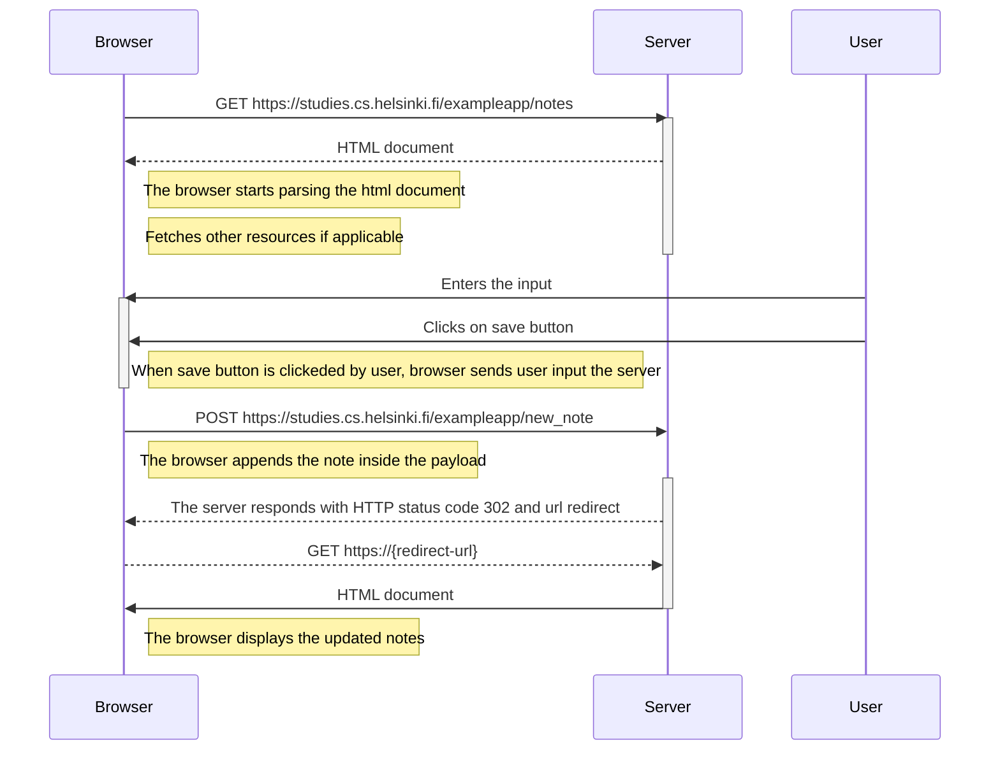
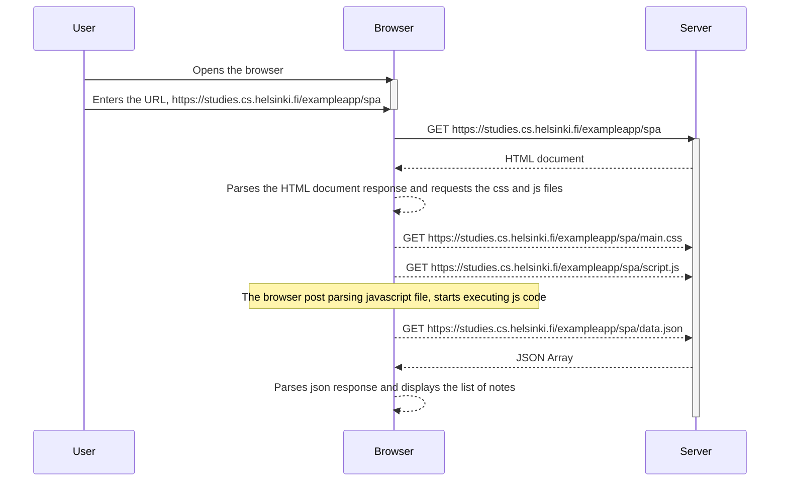
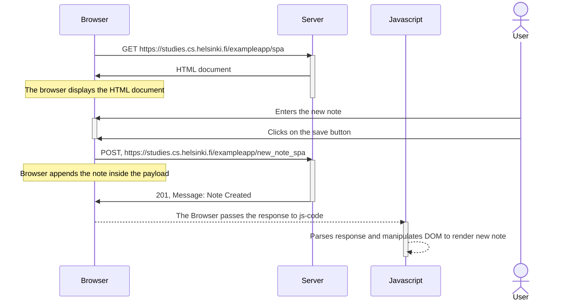

## Part 0.4

```mermaid
sequenceDiagram
    participant Browser
    participant Server
    participant User
    
    Browser->>Server: GET https://studies.cs.helsinki.fi/exampleapp/notes
    activate Server
    Server-->>Browser: HTML document
    Note right of Browser: The browser starts parsing the html document
    Note right of Browser: Fetches other resources if applicable
    deactivate Server

    User->>Browser: Enters the input
    activate Browser
    User->>Browser: Clicks on save button
    Note right of Browser: When save button is clickeded by user, browser sends user input the server
    deactivate Browser

    Browser->>Server: POST https://studies.cs.helsinki.fi/exampleapp/new_note
    Note right of Browser: The browser appends the note inside the payload
    activate Server
    Server-->>Browser: The server responds with HTTP status code 302 and url redirect
    Browser-->>Server: GET https://{redirect-url}
    Server->>Browser: HTML document
    deactivate Server
    Note right of Browser: The browser displays the updated notes
```

## Part 0.5

```mermaid
sequenceDiagram
    participant User
    participant Browser
    participant Server

    User->>Browser: Opens the browser
    activate Browser
    User->>Browser: Enters the URL, https://studies.cs.helsinki.fi/exampleapp/spa
    deactivate Browser

    Browser->>Server: GET  https://studies.cs.helsinki.fi/exampleapp/spa
    activate Server
    Server-->>Browser: HTML document
    Browser-->>Browser: Parses the HTML document response and requests the css and js files
    Browser-->>Server: GET  https://studies.cs.helsinki.fi/exampleapp/spa/main.css
    Browser-->>Server: GET  https://studies.cs.helsinki.fi/exampleapp/spa/script.js
    Note over Browser: The browser post parsing javascript file, starts executing js code
    Browser-->>Server: GET  https://studies.cs.helsinki.fi/exampleapp/spa/data.json
    Server-->>Browser: JSON Array
    Browser-->>Browser: Parses json response and displays the list of notes
    deactivate Server
```

## Part 0.6

```mermaid
sequenceDiagram
    participant Browser
    participant Server
    participant Javascript
    Actor User

    Browser->>Server: GET https://studies.cs.helsinki.fi/exampleapp/spa
    activate Server
    Server->>Browser: HTML document
    Note over Browser: The browser displays the HTML document
    deactivate Server

    User->>Browser: Enters the new note
    activate Browser
    User->>Browser: Clicks on the save button
    deactivate Browser

    Browser->>Server: POST, https://studies.cs.helsinki.fi/exampleapp/new_note_spa
    activate Server
    Note over Browser: Browser appends the note inside the payload
    Server->>Browser: 201, Message: Note Created
    deactivate Server

    Browser-->>Javascript: The Browser passes the response to js-code
    activate Javascript
    Javascript-->>Javascript: Parses response and manipulates DOM to render new note
    deactivate Javascript
```